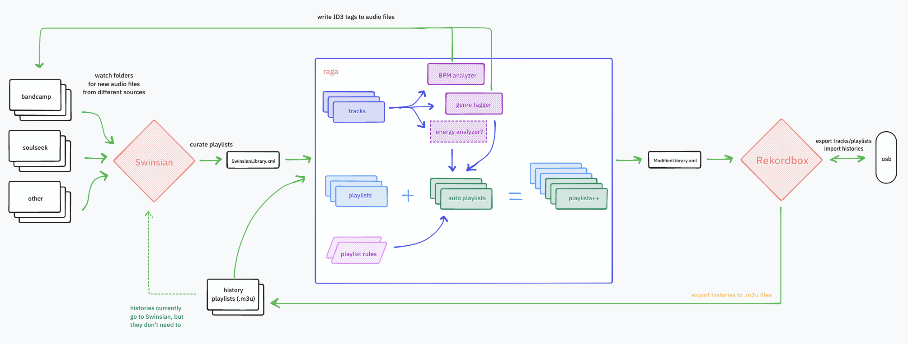
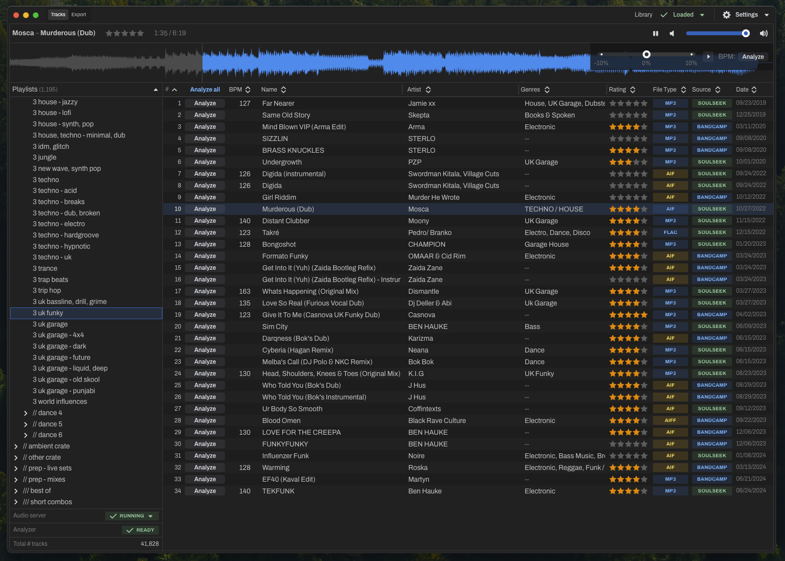

# raga 

> Herramientas para gestionar una gran biblioteca musical digital, diseñadas para DJs

## Motivación

Creé estas herramientas para apoyar mi flujo de trabajo de gestión de biblioteca musical como DJ de música electrónica. Están diseñadas para funcionar con mi sistema particular de gestión musical en macOS, por lo que es posible que no se ajusten exactamente a su caso de uso. No dude en abrir un issue o enviar un correo electrónico (la dirección está en mi perfil de GitHub) si le gustaría ver implementadas funciones adicionales en _raga_.

[Rekordbox](https://rekordbox.com/en/) es el software de gestión de bibliotecas de facto para DJs; es una parte necesaria del flujo de trabajo de cualquier DJ para poder actuar en CDJs. Como la mayoría de los DJs, lo uso para analizar pistas, establecer puntos de cue y exportar a USB. Sin embargo, Rekordbox suele ser lento y torpe de usar; prefiero escuchar música y crear listas de reproducción en una aplicación más eficiente y amigable para el usuario, concretamente una llamada [Swinsian](https://swinsian.com/) para macOS (anteriormente, usaba la aplicación Music de Apple).

Swinsian es bastante bueno en algunas cosas: monitorear carpetas para detectar nuevas descargas de archivos de audio, corregir metadatos y etiquetas de las pistas, y organizar pistas en listas de reproducción (manualmente y con listas inteligentes). Es un gran reemplazo para la aplicación Music de Apple. Sin embargo, le falta algunas funcionalidades importantes para los DJs:

- no puede exportar sus listas de reproducción directamente a Rekordbox
- no puede analizar el tempo/BPM de las pistas
- su sistema de listas inteligentes podría ser mucho más inteligente
- carece de funciones de gestión de etiquetas útiles (basadas en género u otras)

_raga_ pretende resolver estos problemas y muchos más. Algún día, incluso podría ser capaz de subsumir toda la funcionalidad de Swinsian o (_vaya_) de Rekordbox como la aplicación todo en uno para la gestión de bibliotecas musicales de DJs 🔮

Aquí hay un [diagrama de wireframe](https://www.tldraw.com/s/v2_c_VSSSVWHve_idwkbeO6FrB?viewport=97%2C-757%2C4053%2C2350&page=page%3Apage) que ilustra aproximadamente el flujo de trabajo a alto nivel:

## Módulos

### Para DJs: `raga-app`

La mayoría de los usuarios de _raga_ utilizarán la aplicación de escritorio basada en Electron. Sus versiones están disponibles para su descarga [aquí](https://github.com/adidahiya/raga/releases). Con la aplicación Raga, puede:

- importar una biblioteca de Swinsian y navegar por sus listas de reproducción
- analizar el tempo/BPM de las pistas y guardar el valor en las etiquetas ID3 de los archivos de audio
- reproducir pistas con tempo ajustable +/-10%
- calificar pistas (1-5 estrellas)
- exportar una biblioteca de Swinsian a un formato que pueda ser importado por Rekordbox

El código fuente de la aplicación se encuentra en el
[`raga-app` package](https://github.com/adidahiya/raga/blob/main/packages/raga-app/README.md).

### Para Desarrolladores Web: `raga-web-app`

Los componentes de la interfaz web de _raga_ se han extraído en un paquete separado llamado
[`raga-web-app`](https://github.com/adidahiya/raga/blob/main/packages/raga-web-app/README.md).
Esto permite que la interfaz sea:

- Ejecutada como una aplicación web independiente para pruebas y desarrollo
- Desplegada en servidores web estáticos para vista previa y demostración
- Incrustada dentro de la aplicación Electron para la experiencia de escritorio completa

La aplicación web ofrece un conjunto limitado de funciones cuando se ejecuta fuera de Electron debido a las restricciones de seguridad del navegador, pero es útil para el desarrollo y las pruebas de la interfaz.

### Para desarrolladores: `raga-lib` y `raga-cli`

Gran parte de la funcionalidad de gestión de datos de _raga_ reside en una biblioteca Node.js separada llamada
[`raga-lib`](https://github.com/adidahiya/raga/blob/main/packages/raga-lib/README.md).

También hay una CLI llamada
[`raga-cli`](https://github.com/adidahiya/raga/blob/main/packages/raga-cli/README.md)
que proporciona un script de línea de comandos para transformar el XML de una biblioteca exportada desde Swinsian al formato XML compatible con Rekordbox de Music.app.

## Desarrollo

Requisitos:

- Node.js v24.x (consulte la versión especificada en `.nvmrc`)
- Yarn v4.x (consulte la versión especificada en `package.json`)
- Deno v2.x (consulte la [documentación de instalación](https://docs.deno.com/runtime/manual/getting_started/installation))

Para comenzar:

- `corepack enable` - configura el administrador de paquetes Yarn
- Configure las credenciales de la [API de Discogs](https://www.discogs.com/developers), agregue su clave y secreto a `packages/raga-app/.env` con las siguientes claves:
  - `DISCOGS_CONSUMER_KEY`
  - `DISCOGS_CONSUMER_SECRET`

Tareas de desarrollo:

- `yarn dev:web` - ejecuta la aplicación web en modo independiente en http://localhost:3000
- `yarn dev:electron` - ejecuta la aplicación Electron completa con todas las funciones habilitadas
- `yarn build` - compila las fuentes de TypeScript y empaqueta la aplicación Electron
- `yarn dist` - crea el paquete distribuible de la aplicación Electron

Lanzamiento

- `yarn lerna version` - incrementa los números de versión de los paquetes
- `yarn build && yarn dist` - compila las fuentes, empaqueta la aplicación y genera el paquete distribuible
- [Borrador de un nuevo lanzamiento en GitHub](https://github.com/adidahiya/raga/releases/new)
- Suba los binarios generados en `packages/raga-app/out/` al lanzamiento de GitHub

## Acerca de

_¿Qué significa raga?_

[rāga](https://en.wikipedia.org/wiki/Raga) es una palabra en sánscrito que se traduce aproximadamente como:
_un marco melódico para la improvisación en la música clásica india_.

El arte del DJing es en gran medida una cuestión de improvisación dentro del marco personal de la colección musical de cada uno. Los DJs que invierten más tiempo en estudiar, organizar y etiquetar su biblioteca están mejor equipados para ofrecer sus mejores actuaciones. La escala y la complejidad de esta práctica en el medio digital hacen necesarias herramientas y marcos avanzados como _raga_.

_¿Quién creó raga?_

_raga_ fue creado por [Adi Dahiya](https://adi.pizza/), un ingeniero de interfaces, artista de nuevos medios y DJ con base en Brooklyn, NY.
