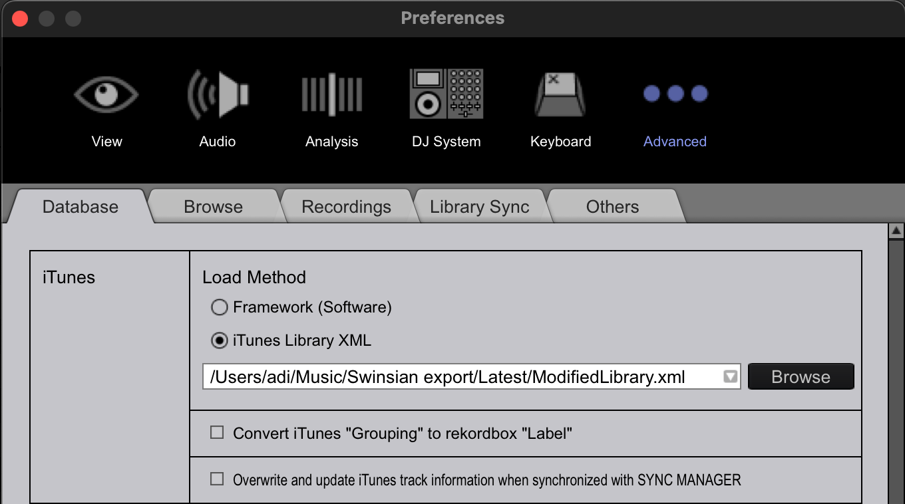
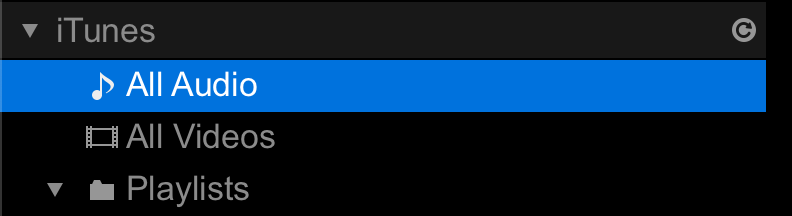

# adi's music library scripts

## `convert-swinsian-to-rekordbox-itunes-xml-library`

Converting a Swinsian library to Rekordbox iTunes XML format.

### 1. Export your Swinsian library to an XML file


### 2. Point the script to the folder you just exported to

TODO

### 3. Run the script to generate a `ModifiedLibrary.xml` file

It will output something like this to the console:

```
Loading library at /Users/adi/Music/Swinsian export/Latest/SwinsianLibrary.xml
loadPlistFile: 11.777s
Building modified library
buildPlistOutput: 8.140s
Writing modified library to /Users/adi/Music/Swinsian export/Latest/ModifiedLibrary.xml
```

### 4. Point Rekordbox to the new modified library file

_This configuration only needs to be done once!_



After the first time you configure Rekordbox to look for `ModifiedLibrary.xml` in this location,
you can just hit the refresh button to load the library when you run this process again:


