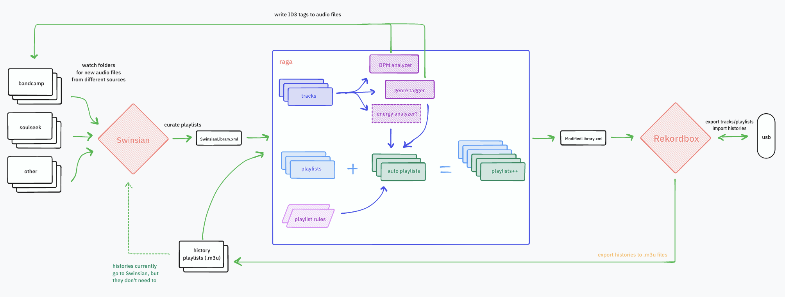
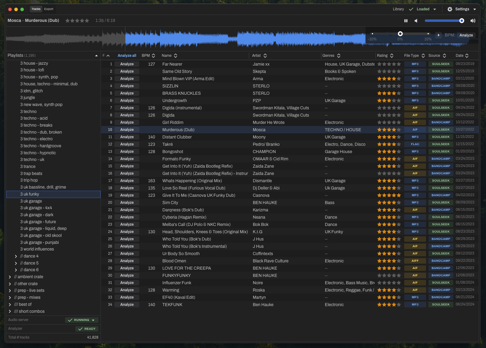

# raga 

> Tools for managing a large digital music library, designed for DJs

## Motivation

I built these tools to support my music library management workflow as an electronic music DJ. They
are designed to work with my particular system of music management on macOS, so they might not fit
your use case exactly. Feel free to file an issue or send an email (address in my GitHub profile) if
you'd like to see additional features implemented in _raga_.

[Rekordbox](https://rekordbox.com/en/) is the de-facto library management software DJs; it's a
necessary part of any DJ's workflow to be able to perform on CDJs. Like most DJs, I use it to
analyze tracks, set cue points, and export to USBs. However, Rekordbox is often slow and clunky to
use; I prefer listening to music and creating playlists in a more performant and user-friendly app,
namely one called [Swinsian](https://swinsian.com/) for macOS (previously, I used Apple's Music app).

Swinsian is pretty good at a few things: watching folders for new audio file downloads, fixing
track metadata & tags, organizing tracks into playlists (manually and with smart playlists). It's a
great replacement for Apple's Music app. However, it lacks some important functionality for DJs:

- it can't export its playlists directly to Rekordbox
- it can't analyze track tempo/BPM
- its smart playlist system could be a lot smarter
- it lacks any meaningful tag management features (genre-based or otherwise)

_raga_ aims to solve these problems and more. One day, it may even be able to subsume all of
Swinsian's or (_gasp_) Rekordbox's functionality as the all-in-one app for DJ music library
management 🔮

Here's a [wireframe diagram](https://www.tldraw.com/s/v2_c_VSSSVWHve_idwkbeO6FrB?viewport=97%2C-757%2C4053%2C2350&page=page%3Apage)
which roughly illustrates the workflow at a high level:

## Modules

### For DJs: `raga-app`

Most _raga_ users will use the Electron-based desktop application. Its releases are available for
download [here](https://github.com/adidahiya/raga/releases). With the Raga app, you
can:

- import a Swinsian library and browse its playlists
- analyze track tempo/BPM and save the value to audio file ID3 tags
- play tracks with adjustable tempo +/-10%
- rate tracks (1-5 stars)
- export a Swinsian library to a format which can be imported by Rekordbox

The source code for the app lives in the
[`raga-app` package](https://github.com/adidahiya/raga/blob/main/packages/raga-app/README.md).

### For Web Developers: `raga-web-app`

The web UI components of _raga_ have been extracted into a separate package called
[`raga-web-app`](https://github.com/adidahiya/raga/blob/main/packages/raga-web-app/README.md).
This allows the UI to be:

- Run as a standalone web application for testing and development
- Deployed to static web servers for preview and demonstration
- Embedded within the Electron app for the full desktop experience

The web app provides a limited set of features when running outside of Electron due to browser
security restrictions, but it's useful for UI development and testing.

### For developers: `raga-lib` and `raga-cli`

Much of _raga_'s data management functionality lives in a separate Node.js library called
[`raga-lib`](https://github.com/adidahiya/raga/blob/main/packages/raga-lib/README.md).

There is also a CLI called
[`raga-cli`](https://github.com/adidahiya/raga/blob/main/packages/raga-cli/README.md)
which provides a command-line script to transform a Swinsian-exported library XML to the
Rekordbox-compatible Music.app XML format.

## Development

Requirements:

- Node.js v20.x (see version specified in `.nvmrc`)
- Yarn v4.x (see version specified in `package.json`)
- Deno v1.x (see [installation docs](https://docs.deno.com/runtime/manual/getting_started/installation))

Getting started:

- `corepack enable` - configures the Yarn package manager
- Set up [Discogs API](https://www.discogs.com/developers) credentials, add your key & secret to `packages/raga-app/.env` with the following keys:
  - `DISCOGS_CONSUMER_KEY`
  - `DISCOGS_CONSUMER_SECRET`

Dev tasks:

- `yarn dev:web` - runs the web app in standalone mode at http://localhost:3000
- `yarn dev:electron` - runs the full Electron app with all features enabled
- `yarn build` - builds TypeScript sources and bundles up the Electron app
- `yarn dist` - creates the Electron app distributable package

Releasing

- `yarn lerna version` - bumps package version numbers
- `yarn build && yarn dist` - builds sources, bundles app, produces distributable package
- [Draft a new GitHub release](https://github.com/adidahiya/raga/releases/new)
- Upload the binaries produced in `packages/raga-app/out/` to the GitHub release

## About

_What does raga mean?_

[rāga](https://en.wikipedia.org/wiki/Raga) is a Sanskrit word which roughly translates to:
_a melodic framework for improvisation in Indian classical music_.

The art of DJing is largely one of improvisation within the personal framework of one's music
collection. DJs who invest more time in studying, organizing, and tagging their library are better
equipped to deliver their best performances. The scale and complexity of this practice in the
digital medium necessitates advanced tools and frameworks like _raga_.

_Who created raga?_

_raga_ was created by [Adi Dahiya](https://adi.pizza/), a UI engineer, new media artist, and DJ
based in Brooklyn, NY.
