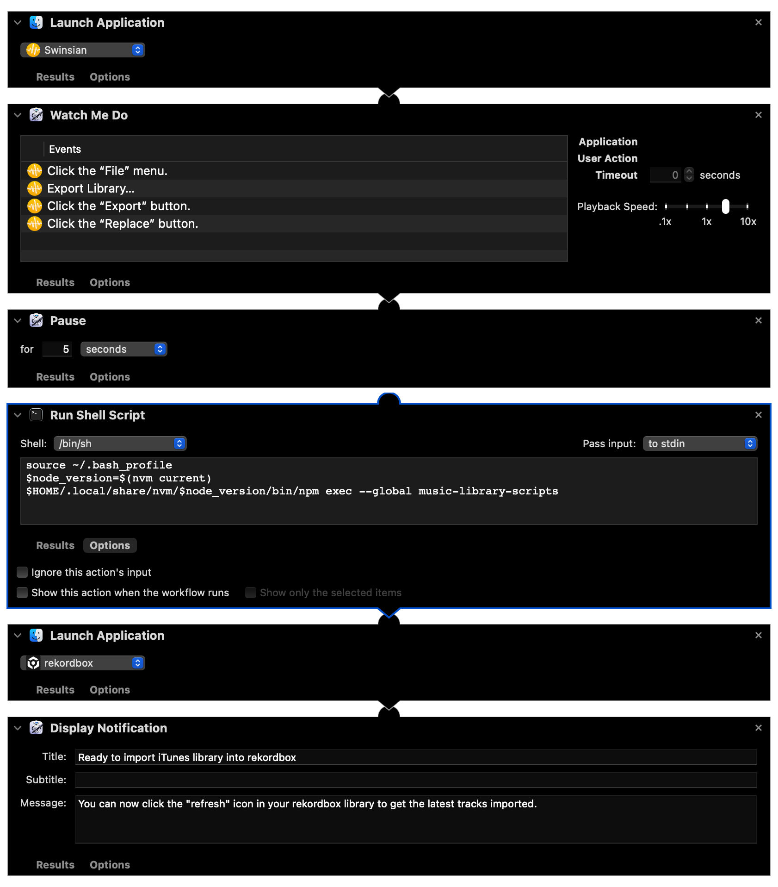

# adi's music library scripts

[](https://www.npmjs.com/package/@adahiya/music-library-scripts)

Requirements: Node.js v19+

## Getting started

Before you run the scripts, you'll need to make sure you have Node.js installed:

-   Install [nvm](https://github.com/nvm-sh/nvm)
-   In a terminal, run `nvm install 19 && nvm use 19`

Next, you can install these scripts as a global NPM library:

```sh
npm install --global @adahiya/music-library-scripts
```

## `convert-swinsian-to-rekordbox-itunes-xml-library`

Converts a Swinsian library to Rekordbox iTunes XML format.

### 1. Export your Swinsian library to an XML file


### 2. Run the Node.js script to generate a `ModifiedLibrary.xml` file

If you have your global `node_modules` configured on your shell's `$PATH` correctly, you can simply run the binary after installing the package:

```
music-library-scripts
```

If not, you can still run it via `npm`:

```
npm exec --global music-library-scripts
```

It will prompt you for a path to the exported `SwinsianLibrary.xml` file, and output something like this to the console:

```
> npm exec --global music-library-scripts

✔ Which script would you like to run? › Convert Swinsian library to Music.app/iTunes XML format
✔ Where is your exported SwinsianLibrary.xml located? … /Users/adi/Music/Swinsian export/Latest
Loading library at /Users/adi/Music/Swinsian export/Latest/SwinsianLibrary.xml
loadPlistFile: 8.220s
Building modified library
buildPlistOutput: 7.693s
Writing modified library to /Users/adi/Music/Swinsian export/Latest/ModifiedLibrary.xml
```

### 3. Point Rekordbox to the new modified library file

_This configuration only needs to be done once!_


After the first time you configure Rekordbox to look for `ModifiedLibrary.xml` in this location,
you can just hit the refresh button to load the library when you run this process again:


### Automator workflow

There's an automator workflow in this repo which does most of the above steps for you. Here's an overview of its steps:



## Development

Requirements:

-   Node.js v20+ (see version specified in `.nvmrc`)
-   PNPM v8+

Tasks

-   Build from source: `pnpm build`
-   Run CLI: `pnpm run-cli`
