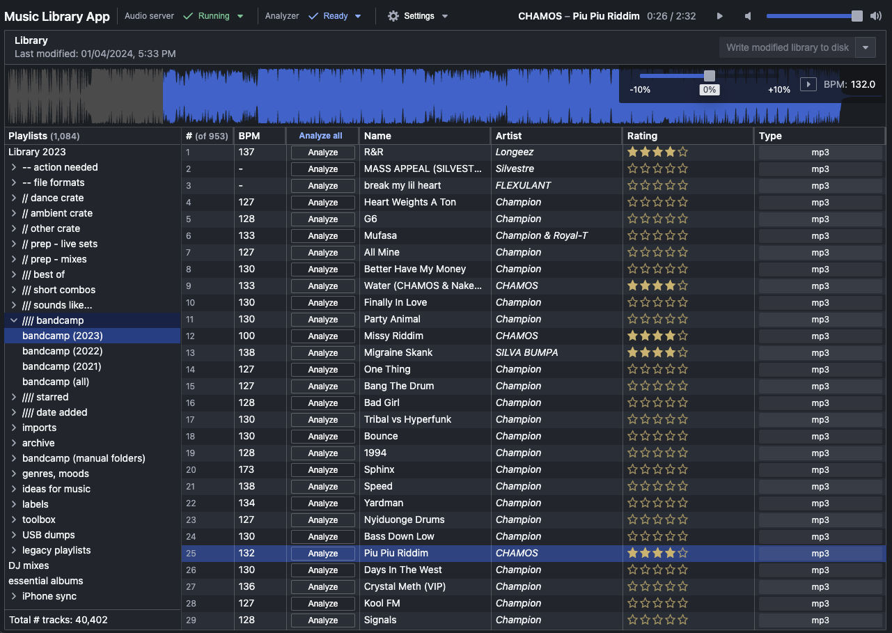

# music-library-app

## Usage guide

Installation: download latest app binary for your OS platform from the [Releases page](https://github.com/adidahiya/music-library-scripts/releases).

### Getting started

Requirements:

- `ffmpeg` must be installed and available on the system path. See installation docs for
  [macOS](https://github.com/fluent-ffmpeg/node-fluent-ffmpeg/wiki/Installing-ffmpeg-on-Mac-OS-X)
  and [Debian](https://github.com/fluent-ffmpeg/node-fluent-ffmpeg/wiki/Installing-ffmpeg-on-Debian).

### Screenshot

