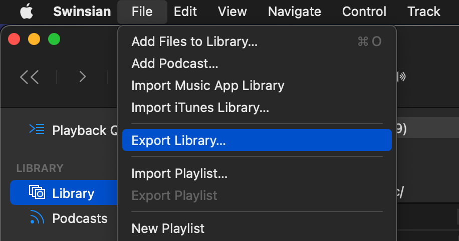
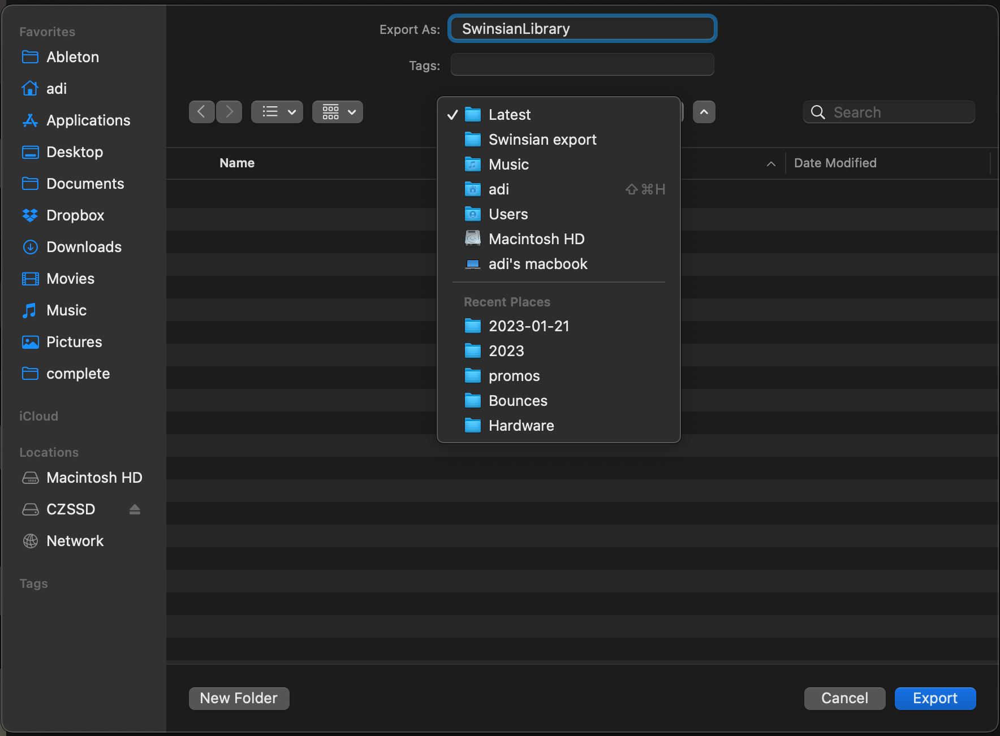
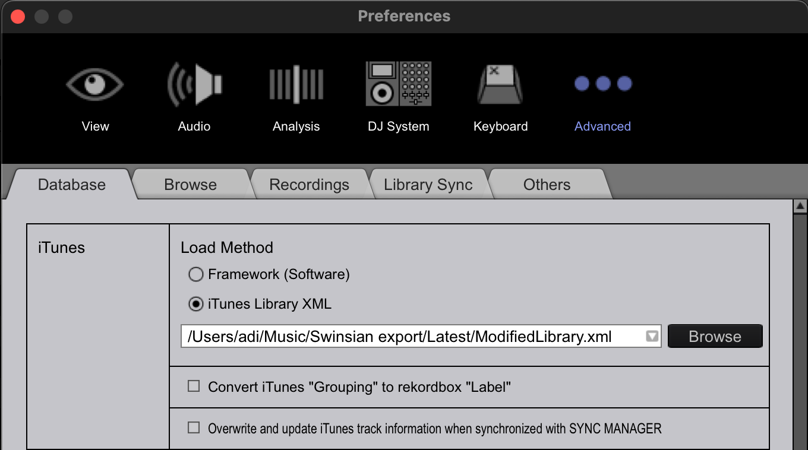
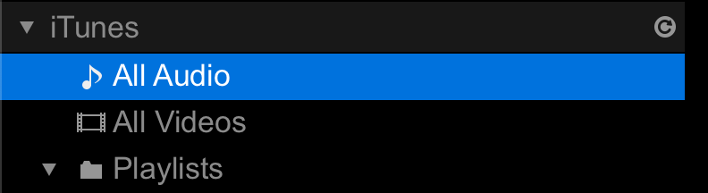

# music-library-tools-cli

[](https://www.npmjs.com/package/@adahiya/music-library-tools-cli)

## Usage guide

> Convert a Swinsian library XML file to Rekordbox/iTunes compatible format

### 1. Export your Swinsian library to an XML file




### 2. Run the `music-library-tools-cli` application

Download the latest release from the [Releases page](https://github.com/adidahiya/music-library-scripts/releases).

Run the application binary for your platform (ARM or x86) and follow the terminal prompts.

```
✔ Which script would you like to run? › Convert Swinsian library to Music.app/iTunes XML format
✔ Where is your exported SwinsianLibrary.xml located? … /Users/adi/Music/Swinsian export/Latest
Loading library at /Users/adi/Music/Swinsian export/Latest/SwinsianLibrary.xml
loadPlistFile: 8.220s
Building modified library
buildPlistOutput: 7.693s
Writing modified library to /Users/adi/Music/Swinsian export/Latest/ModifiedLibrary.xml
```

### 3. Point Rekordbox to the new modified library file

_This configuration only needs to be done once!_



After the first time you configure Rekordbox to look for `ModifiedLibrary.xml` in this location,
you can just hit the refresh button to load the library when you run this process again:



## Development tasks

- Build from source: `yarn build`
- Run CLI: `yarn run-cli`
